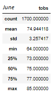
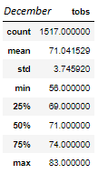
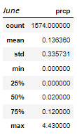
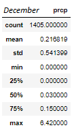

# surfs-up

## Overview of Statistical Analysis
purpose of the analysis is well-defined

## Results
1. June had a higher average temperature (74.9 degrees) compared to December (71.0 degrees). 
2. June had a slightly more consistent temperature (st.dev ±3.3 degrees) compared to December (st.dev ±3.7 degrees). 
3. June had a higher max temperature (85.0 degrees) compared to December (83.0 degrees). 

## Summary
### Temperature Statistics

### Additional Queries
#### June Precipitation Statistics

#### December Precipitation Statistics

